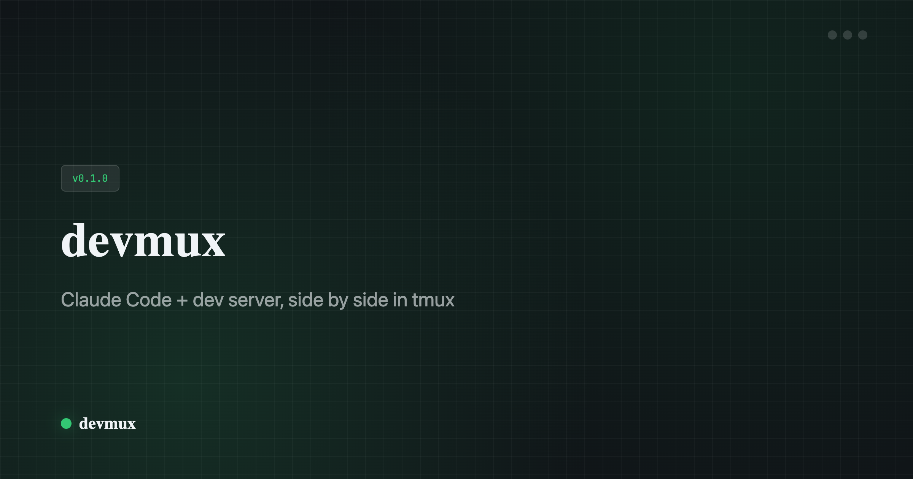

<picture>
  
</picture>

# devmux

Declarative tmux sessions for developers.

One command to create a named tmux session with your tools running. Auto-detects your stack, fully configurable with `.devmux.json`, and a native macOS menu bar app.

## Install

```sh
npm install -g devmux
```

## Quick start

```sh
cd my-project
devmux
```

That's it. devmux creates a tmux session named after your project with Claude Code on the left and your dev server on the right. It detects your package manager and dev command automatically.

## How it works

1. **Run `devmux`** in any project directory
2. A named tmux session is created with configured panes
3. Commands start running in each pane immediately
4. Detach with `Ctrl+b d`, reattach by running `devmux` again
5. Sessions persist in the background until you kill them

## Configuration

Drop a `.devmux.json` in your project root:

```json
{
  "ensure": true,
  "panes": [
    { "name": "claude", "cmd": "claude", "size": 60 },
    { "name": "server", "cmd": "pnpm dev" },
    { "name": "tests",  "cmd": "pnpm test --watch" }
  ]
}
```

### Pane options

| Field  | Description                              |
|--------|------------------------------------------|
| `name` | Label for the pane (for your reference)  |
| `cmd`  | Command to run in the pane               |
| `size` | Width % for the first pane (default: 60) |

### Session options

| Field     | Description                                                                 |
|-----------|-----------------------------------------------------------------------------|
| `ensure`  | Auto-restart exited commands on reattach                                    |
| `prefill` | Type exited commands into panes on reattach without running (you hit Enter) |

### Layouts

```
2 panes — side-by-side          3+ panes — main-vertical

┌──────────┬─────────┐         ┌──────────┬─────────┐
│  claude   │ server  │         │  claude   │ server  │
│  (60%)   │ (40%)   │         │  (60%)   ├─────────┤
└──────────┴─────────┘         │          │ tests   │
                                └──────────┴─────────┘
```

## Auto-detection

Without a config file, devmux reads your `package.json` and picks the right command:

- Checks `scripts.dev`, `scripts.start`, `scripts.serve`, `scripts.watch`
- Detects package manager from lock files (pnpm, bun, yarn, npm)
- Falls back to a shell if no dev command is found

## Menu bar app

A macOS companion app for managing sessions without touching the terminal.

```sh
devmux app          # Launch (builds from source or downloads binary)
devmux app build    # Force rebuild from source
devmux app quit     # Stop the menu bar app
```

Features:
- See all projects and their session status at a glance
- Launch, attach, or detach sessions with a click
- **Command palette** (`Cmd+Shift+M`): Raycast-style launcher for all actions — fuzzy search, keyboard navigation, instant access to projects, window tiling, and settings
- Auto-scans your project directories
- Built with SwiftUI, runs natively on macOS

The app tries to compile from source first (requires Xcode CLI tools), falling back to a pre-built arm64 binary from GitHub releases.

## CLI reference

```
devmux              Create or reattach to a session for the current project
devmux init         Generate a .devmux.json config
devmux ls           List active tmux sessions
devmux kill [name]  Kill a session (defaults to current project)
devmux app          Launch the menu bar companion app
devmux help         Show help
```

## Requirements

- **tmux** — `brew install tmux`
- **Node.js** 18+
- **macOS** (the CLI is macOS-only, the menu bar app requires arm64)

## License

MIT
